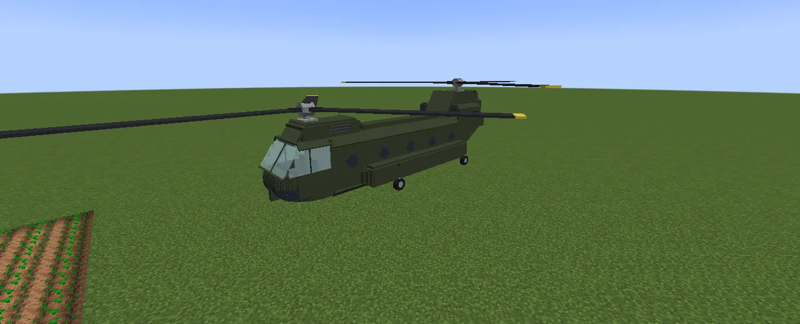
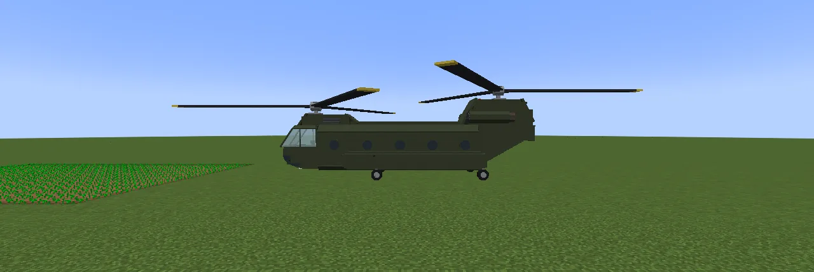
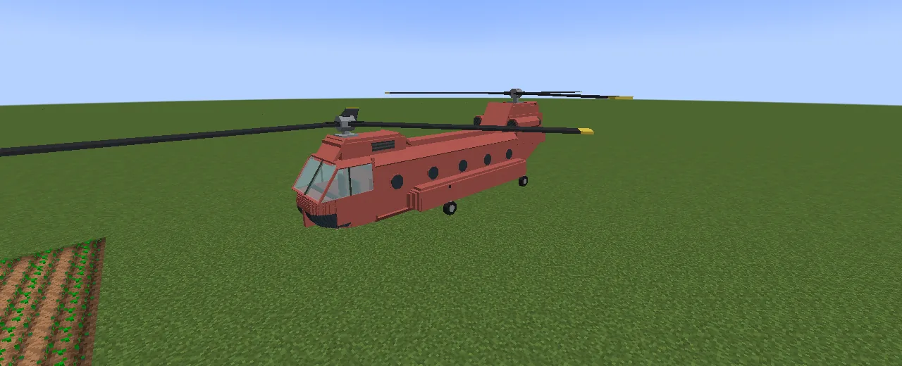
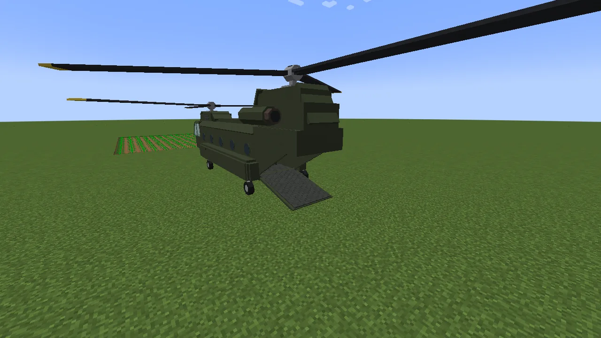
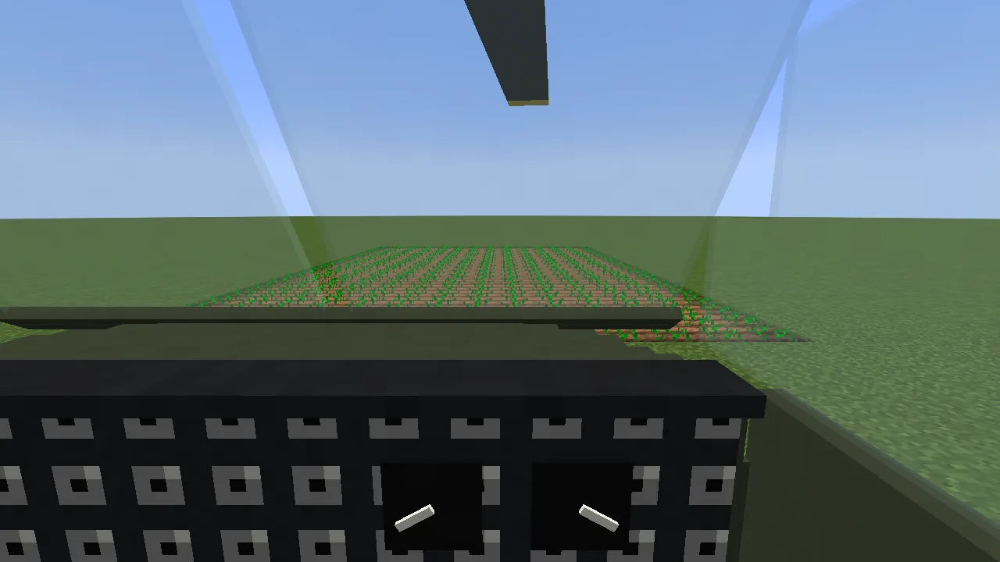
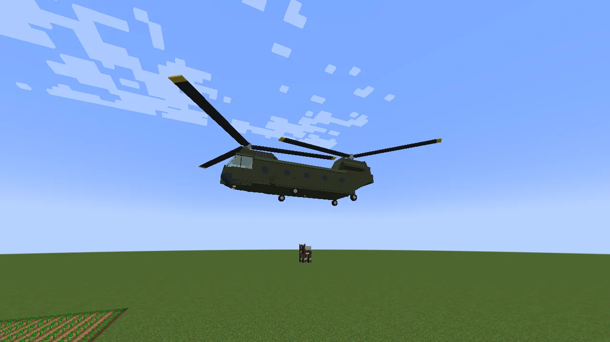
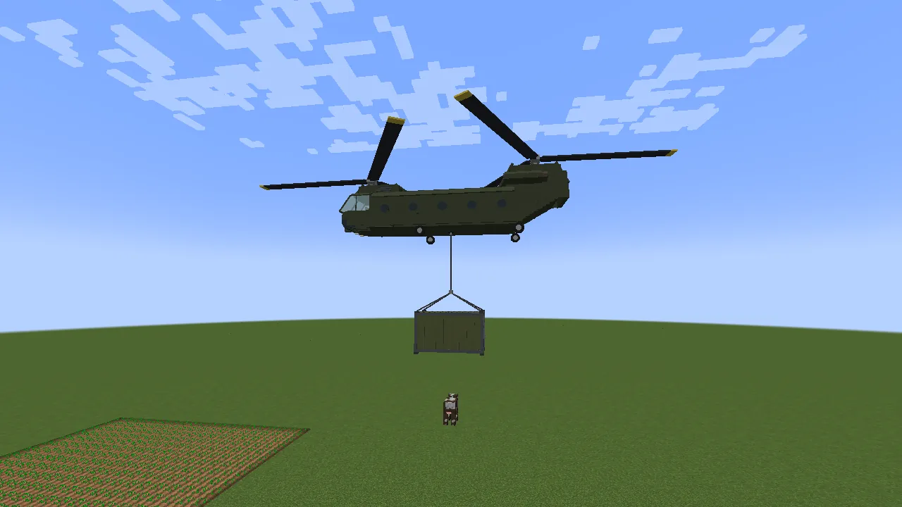
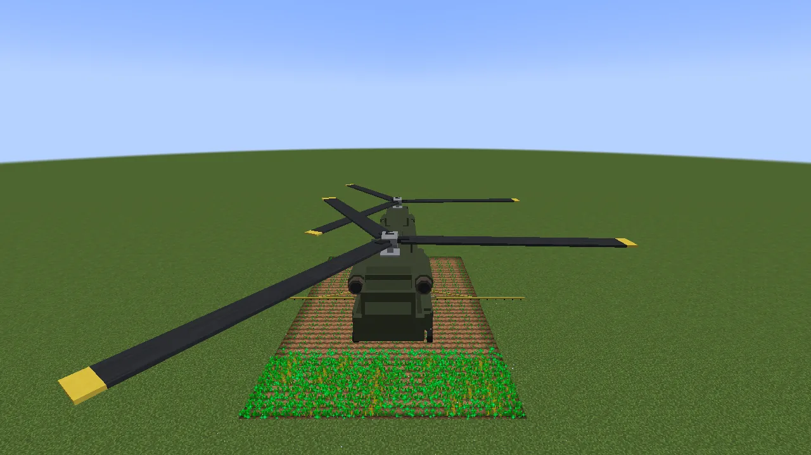

The **Chinook** is a life-size Boeing CH-47, the big twin-rotor transport helicopter, one block to a
metre: sixteen blocks long, with two rotors eighteen across turning opposite ways. A pilot and a
copilot sit up front and twelve more on red troop seats in the cabin; behind them there's room for
**six grown animals** (or twelve young) and **two chests**, all loaded up the **rear ramp**. It
stands on four wheels, carries the [Sling Container](/wiki/rotorcraft) on the hook under its middle,
and takes a crop sprayer fifteen blocks wide. Flying works the same in every
[Rotorcraft](/wiki/rotorcraft) helicopter, so read that page too. Keys, fuel, paint, doors and
repairs are [Vanilla Wheels](/wiki/vanilla-wheels)'s.

## Getting one

1. **The chassis:** two glass panes and seven steel blocks:

   | | | |
   |---|---|---|
   | glass pane | steel block | glass pane |
   | steel block | steel block | steel block |
   | steel block | steel block | steel block |

2. **Build it** on a **Mechanic Lift** with the chassis, an **engine** and **four wheels**. It comes
   out Army green; put a dye in the lift and press **Paint** to colour it.

## Loading the ramp

**Crouch and right-click the ramp** with an empty hand to lower it (again to raise it). With it down,
**right-click the Chinook holding a lead**: every animal on your leads nearby walks aboard while there
is room (a grown animal takes a whole place, a young one half). Crouch and right-click holding a lead
to let them out behind. Animals never board with the ramp up. The two chests are in the cabin.

## Flying it

Get in and you're the pilot (the right-hand seat). The rotors take about **four seconds** to spin up
before it will lift.

| Key | What it does |
|---|---|
| **W / S** | fly forward / back |
| **A / D** | turn |
| **Space** | climb |
| **Left Shift** | descend (it slows down by itself near the ground, so holding it all the way down always lands softly) |
| **R** | get out (only within three blocks of the ground) |
| **G** | hook or let go a load |
| **V** | crop sprayer on / off |
| **H** | lights |

Let go of everything and it hovers. **Nobody aboard is ever hurt by flying**, but flying into things
damages the helicopter: repair it like any vehicle, with **steel ingots**.

## Carrying the Sling Container

Hover over the loaded container until the hook is just above its ring and press **G**. Climb and it
lifts off. Hold **Shift** to set it down softly, then press **G** again to let go.

## The crop sprayer

Right-click the Chinook with a **crop sprayer** to fit it, then with **bone meal** (or bone blocks) to
fill its tank. Fly low over your crops (within twelve blocks) and press **V**: it uses one bone meal
per crop it reaches, along a fifteen-block-wide strip.

## Numbers

Top speed 1.2 blocks a tick (about 86 km/h); climbs 0.35 and descends 0.45 a tick; 48 000 ticks of
fuel (forty minutes of flying).
